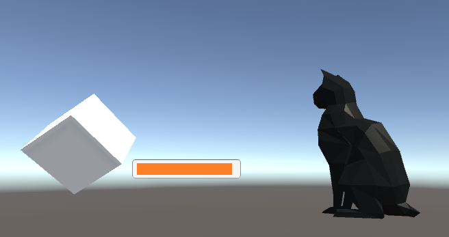

# Unity3D With Azure Blob Storage
This client example usage is for AR Sphere. 

Here, you can see a Unity demonstration that utilizes Azure Blob Storage to stream and display a 3D model at runtime.
 
## Using `BlobModel`
`BlobModel.cs` is a mini-library that helps you read a `.obj` file and display it, _at runtime_, on the `SampleScene`. 
Note: the demo uses a `cat.obj` that I uploaded onto Azure. Any `.obj` file should work as long as the mesh isn't too complicated.

* Loading at runtime is difficult for `.fbx` files; more [resources](http://wiki.unity3d.com/index.php?title=ObjImporter) are available for `.obj` files
* Downloads will automatically be stored in `./Assets/Resources/`
* Downloads should be awaited, so that the file can properly be downloaded before being imported
* Rendering is possible without adding a material, so don't worry about that while testing

Instantiation:
```C#
BlobModel bm = new BlobModel("fileNameOnAzure.obj", "ContainerItIsIn", connectionString);
```

Sample usage:
```C#
BlobModel bm = new BlobModel("cat.obj", "example", cxnstr);
if (await bm.exists())
{
    await bm.download("catmodel.obj"); 
    Debug.Log("Downloaded.");

    Mesh meshHold = new Mesh();
    ObjImporter newMesh = new ObjImporter();
    meshHold = newMesh.ImportFile("./Assets/Resources/catmodel.obj");
    Debug.Log("Imported");

    GameObject myCat = new GameObject();
    MeshRenderer meshRenderer = myCat.AddComponent<MeshRenderer>();
    MeshFilter filter = myCat.AddComponent<MeshFilter>();
    filter.mesh = meshHold;
                                    //./Assets/Resources/metal01.mat
    Material catMaterial = Resources.Load("metal01", typeof(Material)) as Material;
    myCat.GetComponent<MeshRenderer>().material = catMaterial;

    Instantiate(myCat);
    myCat.transform.position = new Vector3(47, -365, -59);

    Debug.Log("Done");
}

```
That provides an output with a cat!



## Why it works
To get started, read below on how you can log to a text file. 

To use `WindowsAzure.Storage`, download the `.unitypackage` using NuGet2Unity, or from [here](https://github.com/BrianPeek/AzureSDKs-Unity/tree/master/_UnityPackages). 

The cube rendered on the screen runs the script `Program.cs`. 

The connection string can typically be found on your Azure Portal. Input your connection string into the InputField, and hit Return. This calls a method that connects to the Blob storage using the connection string.

In the sample code, a container called `example` is created, where `log.txt` is read and updated to append the current date/time. Pretty cool!

Open up Microsoft Azure Storage Explorer to see the result below.


